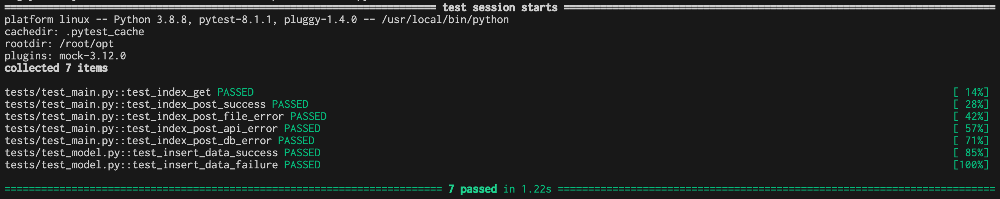

# 強力な画像分析AIで、画像を瞬時に分類！

<p align="center">
  
</p>


[](https://www.docker.com/)


[](https://www.python.org/)
[](https://docs.docker.com/compose/)
[](https://palletsprojects.com/p/flask/)
[](https://pytest.org/)

[](https://www.mysql.com/)
[](https://jquery.com/)
[](https://getbootstrap.com/)


## 概要
このアプリケーションは、AIが画像の分析と評価を行い、画像を分類します。

## 機能一覧
+ 画像保存機能
+ API通信機能
+ DB登録機能
+ 画面表示機能

## インストール

1. 以下のコマンドを実行して、開発サーバーを起動します。

```bash
docker compose up
```

2. アプリケーションにアクセスします。

http://localhost:8080 にアクセスすると、Flaskアプリケーションが起動していることを確認できます。

## ディレクトリ構成

```text
.
├── README.md
├── apserver
├── dbserver
├── docker-compose.yml
├── resource
└── webserver
    ├── Dockerfile
    ├── main.py
    ├── models
    │   ├── __init__.py
    │   ├── base.py
    │   └── dao.py
    ├── requirements.txt
    ├── settings.ini
    ├── settings.py
    ├── static
    │   ├── bootstrap.min.css
    │   ├── bootstrap.min.js
    │   ├── image
    │   └── jquery-3.7.1.min.js
    ├── templates
    │   └── index.html
    ├── tests
    │   ├── __init__.py
    │   ├── test_main.py
    │   └── test_model.py
    └── utils
        ├── __init__.py
        └── helper.py
```

#### apserver
アプリケーションサーバー関連ファイルなどが置かれます。

#### dbserver
データベースサーバー関連の設定ファイルなどが置かれます。具体的には、データベースの種類、接続情報、スキーマ定義ファイルなどです。

#### resource
Readme.mdで使用される静的ファイルなどのリソースが置かれます。

#### webserver
Webアプリケーション本体が置かれています。

## 設定ファイル

#### docker-compose.yml
Docker Compose の設定ファイルです。このファイルには、アプリケーションを構成するコンテナとその設定情報が定義されています。

#### settings.ini
設定ファイル (INI形式)です。アプリケーションの設定情報などを記述します。

#### settings.py
設定ファイル (Python形式)です。settings.ini と同様に、アプリケーションの設定情報などを記述します。

## テスト

このプロジェクトは、pytest を使用してテストされています。

### テストディレクトリ構成

```text
webserver
├── tests
│   ├── __init__.py
│   ├── test_main.py
│   └── test_model.py
```

+ init.py: テストディレクトリ初期化ファイルです。
+ test_main.py: main.py のテストコードです。
+ test_model.py: models ディレクトリ内のモデルのテストコードです。

実行方法
以下のコマンドでテストを実行できます。

```bash
docker compose exec web pytest tests/ -v
```

#### テスト対象
以下の項目がテスト対象となります。

+ main.py の関数
+ models ディレクトリ内のモデル

#### テスト項目
以下の項目がテスト項目となります。

##### main.py の関数
+ GETメソッドによるアクセステスト
+ POSTメソッドによる正常処理テスト
+ POSTメソッドによるファイルエラーテスト
+ POSTメソッドによるAPIエラーテスト
+ POSTメソッドによるDBエラーテスト

##### models ディレクトリ内のモデル
+ 成功判定データを入れた場合の正常処理テスト
+ 失敗判定データを入れた場合の正常処理テスト

#### テスト結果

<p align="center">
  
</p>


